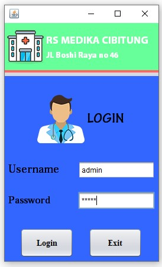
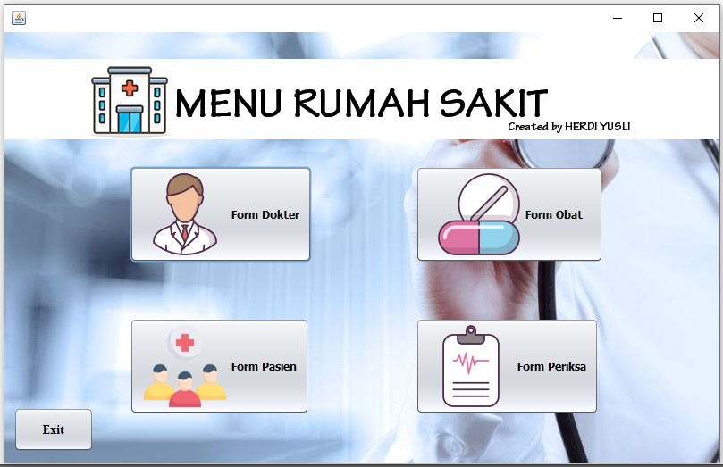
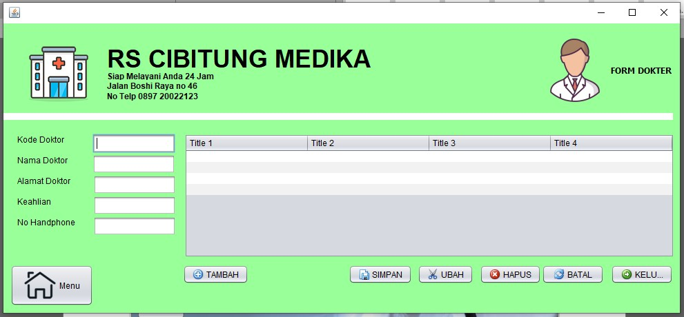
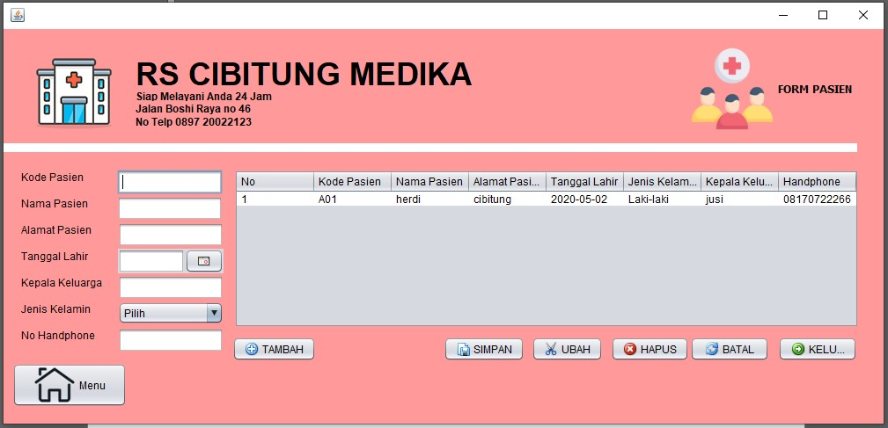
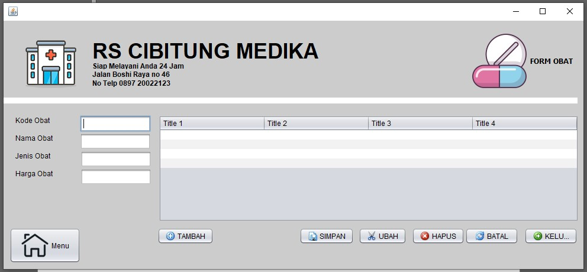
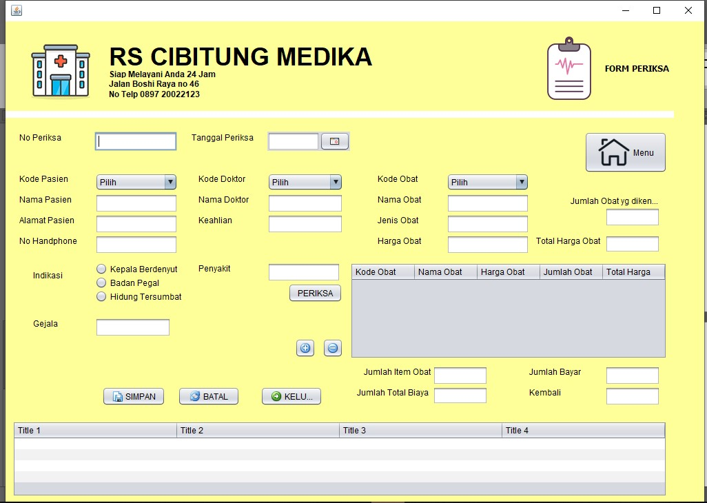

# aplikasi-rekam-medis-RS-CIMED
TUGAS INFORMATIKA KESEHATAN - Pembuatan Aplikasi rekam medis RS Cibitung Medika  

Tutor Penggunaan
Untuk membuka prototype pastikan pc yang digunakan user sudah terinstall java

1. open folder dist
2. klik 2x pada Aplikasi RS Cibitung Medika By Herdi Yusli
3. login dengan default username “admin” dan password “admin”.

Tunggu sampai aplikasi terbuka.

Tampilan Aplikasi  
 
<b> Tampilan Login <b>  

 
 
<b> Tampilan Menu Awal <b>  

 
 
<b> Tampilan Form Dokter <b>  

 
 
<b> Tampilan Form Pasien <b>  

 
 
<b> Tampilan Form Obat <b>  

 
 
<b> Tampilan Form Detail Pemeriksaan <b>  

